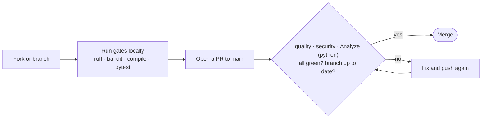

# Contributing

Thanks for your interest in `candidate-suite`. This repository ships a single
Claude **skill** (an orchestrator plus seven internal sub-modules). Most of the
Python code uses the standard library; a few scripts additionally rely on
packages and binaries **provided by the Claude execution environment** —
`python-docx` (cover letter), `markdown` plus `wkhtmltopdf` / `libreoffice` (PDF
export). These are **not declared** in any manifest (there is no
`requirements.txt` / `pyproject` dependency list); install them locally only if
you run those scripts or their tests (see Prerequisites).

This guide is for two audiences:

- **Contributors** who want to propose a change via a pull request (you do not
  need to be an administrator of the repository).
- **Forkers** who want to run their own version. For forks, also read
  [`docs/ci-cd.md`](docs/ci-cd.md), which explains which protections live in
  files (and travel with a fork) and which live in repository settings (and do
  **not**).

## Ground rules

`main` is protected. **You cannot push to it directly.** Every change lands
through a pull request that must pass the required checks before it can be
merged. As a non-administrator you cannot bypass these checks, change branch
protection, or alter repository settings — that is by design.

## Prerequisites

- **Python 3.12** (the version the CI runs on).
- The two quality/security tools, **pinned to the exact CI versions** so your
  local result matches CI:

```bash
python -m pip install "ruff==0.15.16" "bandit[toml]==1.9.4" pytest
```

To run the cover-letter or PDF scripts (and their tests), also install the
runtime packages the Claude environment normally provides:

```bash
python -m pip install python-docx markdown
```

PDF export additionally needs the `wkhtmltopdf` or `libreoffice` binary; tests
that convert to PDF are skipped when it is absent.

A virtual environment is recommended but not required.

## Reproduce the gates locally (before you push)

Run the same four checks the CI runs, from the repository root. If they pass
locally, your pull request will go green on the first try.

```bash
ruff check .                       # lint
ruff format --check .              # formatting (does not modify files)
python -m compileall -q scripts modules   # every script must byte-compile
bandit -c pyproject.toml -r .      # security scan (SAST)
pytest tests/                      # test slot — see note below
```

Notes:

- `ruff format --check .` only reports; to apply formatting run `ruff format .`.
- Both `ruff` and `bandit` scan the **whole repository**, including `tooling/`.
- There is no test suite yet (the acceptance suite, "TST-1", is planned).
  `pytest` therefore exits with code 5 ("no tests collected"); the CI treats
  that as success. When you add tests, put them under `tests/`.

## Pull request workflow




1. **Fork** the repository (or, if you have write access, create a branch).
2. Create a topic branch, e.g. `git checkout -b fix/short-description`.
3. Make your change and run the gates locally (above).
4. Commit and push your branch, then open a pull request targeting `main`.
5. Wait for the required checks to pass:
   - **`quality`** — ruff lint + format, compile sweep, test slot.
   - **`security`** — Bandit security scan.
   - **`Analyze (python)`** — CodeQL semantic security analysis.
6. Your branch must be **up to date with `main`** before merging (rebase or
   merge `main` in if it has moved).
7. A merge is also blocked if CodeQL reports a code-scanning alert at or above
   the configured threshold (security severity High+, or any error).

The full description of each gate is in [`docs/ci-cd.md`](docs/ci-cd.md).

## Commit conventions

- Use a short, conventional prefix: `ci:`, `docs:`, `fix:`, `feat:`, `chore:`.
- A reformatting commit is recorded in `.git-blame-ignore-revs`. To keep
  `git blame` clean locally, run once:
  `git config blame.ignoreRevsFile .git-blame-ignore-revs`.
- The maintainer commits with a GitHub `noreply` email to avoid leaking a real
  address in public history. You are free to use your own identity; consider
  GitHub's `noreply` address if you want the same privacy.

## What not to commit

- No personal data (names, addresses, real CVs, real company names). Example and
  test data must be fictional.
- `*.skill` build artifacts and `dist/` are git-ignored; the release workflow
  builds and publishes them.
