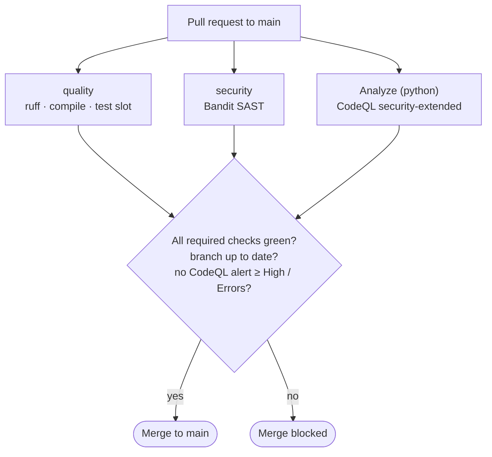
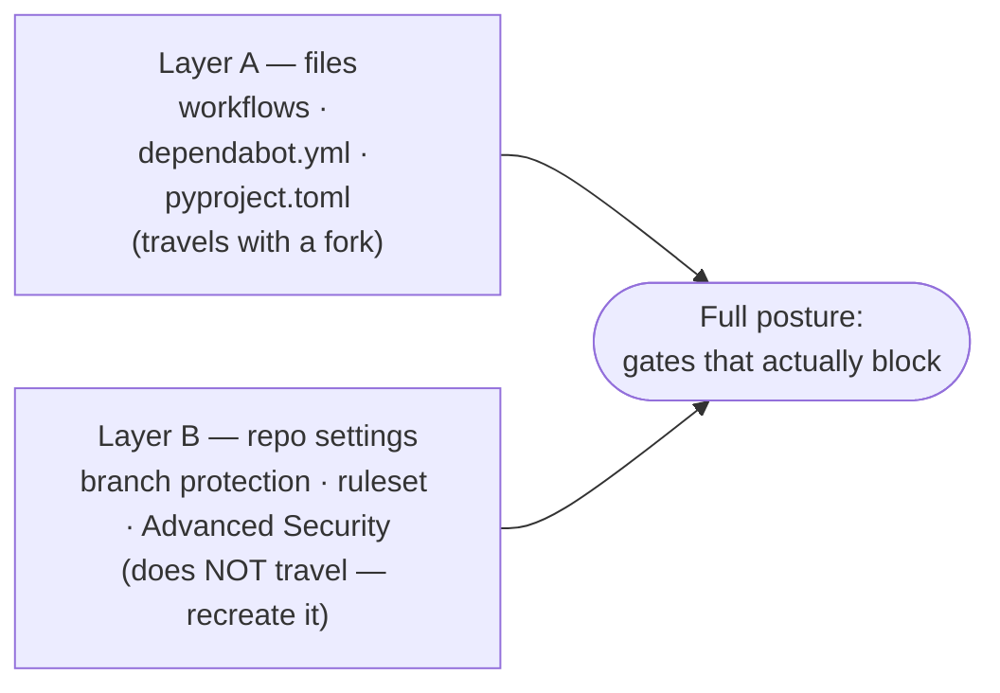
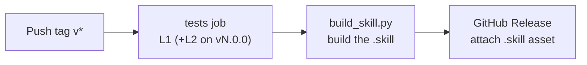

# CI/CD pipeline

This document describes the continuous-integration and continuous-delivery
chain of `candidate-suite`: what each piece does, how the protections fit
together, and — importantly — **what travels with a fork and what does not**.

It complements [`CONTRIBUTING.md`](../CONTRIBUTING.md), which covers the
day-to-day contributor workflow.

---

## 1. Overview

The chain is a **gated pull-request flow**. Nothing reaches `main` except
through a pull request that passes every required gate. On top of the gates,
several detection and maintenance features run continuously.

Two more flows run outside the pull-request gate: detection features run
**continuously** (secret scanning + push protection, Dependabot), and the
**release** runs on a version tag (Section 2).

The enforcement has **two layers**:

- **Layer A — files in the repository** (travel with a fork): the workflows,
  Dependabot config, and tooling configuration.
- **Layer B — repository settings** (do **not** travel with a fork): branch
  protection, the code-scanning ruleset, and the Advanced Security toggles.

Both layers are required for the full posture. Section 6 lists exactly what a
fork must reconfigure.

---

## 2. Workflows (Layer A — in `.github/workflows/`)

| Workflow | Trigger | Job (check name) | What it enforces |
|---|---|---|---|
| `ci.yml` | PR to `main`, push to `main` | `quality` | `ruff check` (lint) → `ruff format --check` → `python -m compileall scripts modules` |
| `tests.yml` | PR to `main`, push to `main` | `tests` | pytest suite (TST-1), level L0: stdlib + python-docx + markdown logic; PDF-conversion tests skipped |
| `security.yml` | PR to `main`, push to `main` | `security` | Bandit SAST: `bandit -c pyproject.toml -r .` over the whole repo |
| `codeql.yml` | PR to `main`, push to `main`, weekly (Mon 06:00 UTC) | `Analyze (python)` | CodeQL semantic analysis, `security-extended` query suite |
| `release.yml` | push of a tag `v*` | `tests`, `build-and-release` | runs the graded suite (L1, +L2 on `vN.0.0`), then builds the `.skill` and attaches it to a Release — the build `needs:` the tests job |

The release path, on a version tag:

Design notes:

- The quality and security tools are **pip-installed and version-pinned**
  (`ruff==0.15.16`, `bandit[toml]==1.9.4`) rather than run via a marketplace
  action. This keeps results deterministic and adds **no extra GitHub Action**
  to maintain.
- The scans cover the **whole repository** (including `tooling/`), mirroring
  how the quality gate behaves.
- CodeQL uses **advanced setup** (a committed workflow), not GitHub's "default
  setup". The two are mutually exclusive — do not enable default setup on top of
  this workflow. `security-extended` is chosen deliberately: it is broader than
  the default query suite.
- Tests live in a **dedicated `tests.yml`** (check `tests`), not folded into
  `quality`. The suite is **graded**: L0 on every PR/push (stdlib + python-docx
  + markdown; PDF conversions skipped); at a release tag the `tests` job in
  `release.yml` runs L1 (+ wkhtmltopdf) and, on a major tag `vN.0.0`, L2 (+
  LibreOffice). The release build `needs:` that job, so a failing suite blocks
  the release.
- `release.yml` carries a `TODO` to resync the interface-language list before
  building. It is a planned addition; the build itself works without it.

---

## 3. Tooling configuration (Layer A — `pyproject.toml`, single source of truth)

- **`[tool.ruff]` / `[tool.ruff.lint]`** — rule set `E4`/`E7`/`E9`/`F`;
  `E402` (import not at top of file) is ignored on purpose, because several
  scripts define a helper or constant before their imports.
- **`[tool.bandit]`** — Bandit reads this when run with `-c pyproject.toml`
  (hence the `[toml]` extra). The skips are **deliberate, documented**
  exceptions, not blanket silencing:
  - `B404` (import subprocess) — informational; the suite orchestrates local
    converters (`wkhtmltopdf`/`soffice`).
  - `B603` (subprocess without `shell=True`) — this is the **safe** form: every
    call uses a fixed argument list, never a shell string, with no
    user-controlled tokens.
  - `B607` (start process with partial path) — converters are invoked by name in
    a controlled environment with a trusted `PATH`.
  - The dangerous case, **`B602` (`shell=True`), stays active.**
- **`[tool.pytest.ini_options]`** — `testpaths = ["tests"]`.
- **`.git-blame-ignore-revs`** — records the bulk-reformat commit so it does not
  pollute `git blame`. Activate locally with
  `git config blame.ignoreRevsFile .git-blame-ignore-revs`.

**Runtime dependencies (environment-provided, not declared).** A few scripts use
`python-docx` (cover letter), `markdown` (the HTML stage of PDF export), and the
`wkhtmltopdf` / `libreoffice` binaries (PDF conversion). The Claude execution
environment provides these; they are intentionally **not** pinned in a manifest.
A fork must ensure its environment provides them to run those scripts.

---

## 4. Dependabot (Layer A — `.github/dependabot.yml`)

Scope: the **`github-actions`** ecosystem only. The skill's Python dependencies
(`python-docx`, `markdown`) are provided by the runtime environment and are not
declared in a manifest, so there is no Python dependency file for a pip ecosystem
to track. Dependabot opens pull requests that bump the action tags pinned in
`.github/workflows/`, on a **monthly** cadence.

Important distinction: the monthly cadence governs **version updates**.
**Security updates** (vulnerability-driven fixes) are immediate and are
controlled by a repository-settings toggle (Layer B), independent of the
monthly schedule.

This config is what keeps the runtime current — for example, it is how the
actions were moved off the deprecated Node 20 runtime onto Node 24.

---

## 5. Repository settings (Layer B — NOT in files, do not travel with a fork)

These are configured in the GitHub UI and must be recreated in any fork that
wants the same protection.

**Branch protection on `main`** (Settings → Branches):

- Require a pull request before merging.
- Require status checks to pass: **`quality`**, **`security`**,
  **`Analyze (python)`**, **`tests`**.
- Require branches to be up to date before merging.
- Block force pushes; restrict deletions; do not allow bypassing (admins
  included).

**Ruleset for code-scanning results** (Settings → Rules → Rulesets), targeting
the default branch:

- Require code scanning results, tool **CodeQL**, thresholds:
  **security alerts ≥ High or higher**, **alerts = Errors**.

This is distinct from the `Analyze (python)` status check: the check verifies
the analysis **ran**; the ruleset blocks the merge when **alerts exist** above
the threshold.

**Advanced Security** (Settings → Advanced Security / Code security):

- CodeQL — recognized as advanced setup once `codeql.yml` has run.
- **Secret scanning** + **push protection** — on. (This is the native
  replacement for a third-party secret scanner; a pushed secret is blocked at
  push time.)
- **Dependabot alerts**, **malware alerts**, **security updates**,
  **grouped security updates** — on.
- **Dependency graph** — on.
- **Private vulnerability reporting** — on (optional but recommended).
- **Automatic dependency submission** — **off**, deliberately: the skill's
  Python dependencies are provided by the runtime environment and are not
  declared in a manifest, so there is nothing for dependency submission to
  detect.

---

## 6. Forking your own version

A fork copies the default branch and therefore **all of Layer A** (workflows,
Dependabot config, tooling configuration). It copies **none of Layer B**. To
get the same posture in your fork:

1. **Enable Actions.** GitHub disables workflows on new forks. Go to the
   **Actions** tab and enable them.
2. **Public vs private fork.** Code scanning (CodeQL), secret scanning, and
   push protection are **free on public repositories**. On a **private** fork
   they require GitHub's paid code-security features.
3. **Enable Advanced Security features** (Settings → Advanced Security): turn on
   secret scanning + push protection, and Dependabot alerts + security updates.
   CodeQL is picked up automatically from `codeql.yml` on the first run — do not
   also enable CodeQL default setup.
4. **Recreate branch protection** on your default branch with the four required
   checks (`quality`, `security`, `Analyze (python)`, `tests`) and "require branches up
   to date" (Section 5).
5. **Recreate the code-scanning ruleset** (CodeQL, High+/Errors) so alerts
   block merges (Section 5).
6. *(Optional)* malware alerts, grouped security updates, private vulnerability
   reporting.

Until steps 3–5 are done, the workflows will still **run** (and you can read
their results), but nothing **blocks** a merge — the blocking comes from
Layer B.

---

## 7. Security posture summary (defense in depth)

| Control | Layer | Blocks |
|---|---|---|
| `quality` required check | B (branch) | broken lint/format/compile |
| `security` required check | B (branch) | Bandit finding |
| `Analyze (python)` required check | B (branch) | CodeQL analysis failure |
| `tests` required check | B (branch) | failing test (TST-1, level L0) |
| Code-scanning ruleset | B (ruleset) | CodeQL **alerts** ≥ High / Errors |
| Secret scanning + push protection | B (Adv. Security) | a secret at push time |
| Dependabot alerts / security updates | B (Adv. Security) | vulnerable dependency (alerts; auto-fix PRs) |
| Dependabot version updates | A (`dependabot.yml`) | stale action versions (keeps runtime current) |

A few caveats worth knowing:

- **`release.yml` is only exercised on a tag push.** A pull request's gates do
  not run it, so a green PR does not prove the release still works. Validate the
  release path (the `.skill` asset is published) when you next push a `v*` tag.
- Action pins are **floating majors** (e.g. `@v6`); Dependabot proposes bumps
  when a new major ships. Review the PR's compatibility notes before merging.
